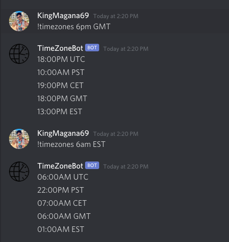

# TimezoneBot
Discord bot that converts the given time + timezone to a list of different times + timezones.

# Example

Currently supports the following timezones: 
- UTC
- US/Pacific
- Europe/Berlin
- GMT
- US/Eastern

More can be added upon request! :) 